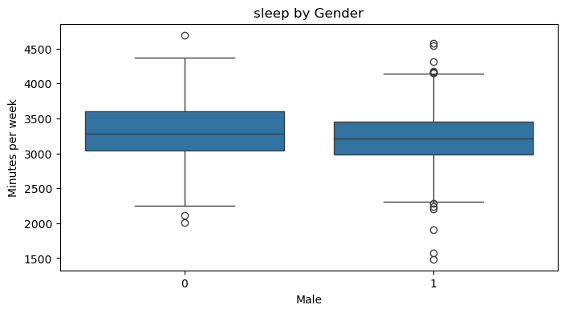

# Sleep and the Allocation of Time: Data Analysis

This notebook analyzes the "Sleep and the Allocation of Time" dataset, following the approach of Biddle and Hamermesh. We will perform data wrangling, exploratory analysis, visualization, and statistical modeling, and discuss econometric issues such as missing data and endogeneity.

## 1. Import Libraries


```python
import pandas as pd
import numpy as np
import matplotlib.pyplot as plt
import seaborn as sns
import statsmodels.api as sm
```

## 2. Load Data

We load the dataset and assign column names based on the data description.


```python
col_names = [
    "age", "black", "case", "clerical", "construc", "educ", "earns74", "gdhlth", "inlf",
    "leis1", "leis2", "leis3", "smsa", "lhrwage", "lothinc", "male", "marr", "prot",
    "rlxall", "selfe", "sleep", "slpnaps", "south", "spsepay", "spwrk75", "totwrk",
    "union", "worknrm", "workscnd", "exper", "yngkid", "yrsmarr", "hrwage", "agesq"
]

df = pd.read_csv("sleep75.txt", delim_whitespace=True, names=col_names)
```

    /var/folders/y1/k00y87l50_59zy_2c9drqj000000gn/T/ipykernel_13319/3388554324.py:8: FutureWarning: The 'delim_whitespace' keyword in pd.read_csv is deprecated and will be removed in a future version. Use ``sep='\s+'`` instead
      df = pd.read_csv("sleep75.txt", delim_whitespace=True, names=col_names)


## 3. Data Wrangling

We clean the data by replacing missing values, converting data types, and dropping rows with missing values in key variables.


```python
df = df.replace('.', np.nan)
df = df.apply(pd.to_numeric, errors='coerce')
df = df.dropna(subset=["male", "sleep", "slpnaps", "hrwage", "educ", "age"])
```

## 4. Choose Response Variable

We select the response variable based on gender:  
- If male: use `sleep` (minutes of sleep at night per week)  
- If female: use `slpnaps` (minutes of sleep including naps per week)
- I am male so i will use the sleep


```python
response_var = "sleep"
print(f"Response variable: {response_var}")
```

    Response variable: sleep


## 5. Exploratory Data Analysis

Let's look at summary statistics for the dataset.


```python
df.describe()
```


<div>
<style scoped>
    .dataframe tbody tr th:only-of-type {
        vertical-align: middle;
    }

    .dataframe tbody tr th {
        vertical-align: top;
    }

    .dataframe thead th {
        text-align: right;
    }
</style>
<table border="1" class="dataframe">
  <thead>
    <tr style="text-align: right;">
      <th></th>
      <th>age</th>
      <th>black</th>
      <th>case</th>
      <th>clerical</th>
      <th>construc</th>
      <th>educ</th>
      <th>earns74</th>
      <th>gdhlth</th>
      <th>inlf</th>
      <th>leis1</th>
      <th>...</th>
      <th>spwrk75</th>
      <th>totwrk</th>
      <th>union</th>
      <th>worknrm</th>
      <th>workscnd</th>
      <th>exper</th>
      <th>yngkid</th>
      <th>yrsmarr</th>
      <th>hrwage</th>
      <th>agesq</th>
    </tr>
  </thead>
  <tbody>
    <tr>
      <th>count</th>
      <td>532.000000</td>
      <td>532.000000</td>
      <td>532.000000</td>
      <td>532.000000</td>
      <td>532.000000</td>
      <td>532.000000</td>
      <td>532.000000</td>
      <td>532.000000</td>
      <td>532.0</td>
      <td>532.000000</td>
      <td>...</td>
      <td>532.000000</td>
      <td>532.000000</td>
      <td>532.000000</td>
      <td>532.000000</td>
      <td>532.000000</td>
      <td>532.000000</td>
      <td>532.000000</td>
      <td>532.000000</td>
      <td>532.000000</td>
      <td>532.000000</td>
    </tr>
    <tr>
      <th>mean</th>
      <td>38.317669</td>
      <td>0.050752</td>
      <td>266.500000</td>
      <td>0.182331</td>
      <td>0.030075</td>
      <td>12.731203</td>
      <td>9703.947368</td>
      <td>0.885338</td>
      <td>1.0</td>
      <td>4659.988722</td>
      <td>...</td>
      <td>0.524436</td>
      <td>2160.545113</td>
      <td>0.219925</td>
      <td>2130.272556</td>
      <td>30.272556</td>
      <td>19.586466</td>
      <td>0.140977</td>
      <td>11.176692</td>
      <td>5.082839</td>
      <td>1594.186090</td>
    </tr>
    <tr>
      <th>std</th>
      <td>11.232965</td>
      <td>0.219697</td>
      <td>153.719441</td>
      <td>0.386480</td>
      <td>0.170955</td>
      <td>2.693566</td>
      <td>8214.777772</td>
      <td>0.318913</td>
      <td>0.0</td>
      <td>892.359993</td>
      <td>...</td>
      <td>0.499873</td>
      <td>933.404842</td>
      <td>0.414585</td>
      <td>929.333193</td>
      <td>147.130248</td>
      <td>12.188339</td>
      <td>0.348326</td>
      <td>11.232971</td>
      <td>3.704385</td>
      <td>935.689295</td>
    </tr>
    <tr>
      <th>min</th>
      <td>23.000000</td>
      <td>0.000000</td>
      <td>1.000000</td>
      <td>0.000000</td>
      <td>0.000000</td>
      <td>1.000000</td>
      <td>0.000000</td>
      <td>0.000000</td>
      <td>1.0</td>
      <td>2090.000000</td>
      <td>...</td>
      <td>0.000000</td>
      <td>0.000000</td>
      <td>0.000000</td>
      <td>0.000000</td>
      <td>0.000000</td>
      <td>0.000000</td>
      <td>0.000000</td>
      <td>0.000000</td>
      <td>0.350000</td>
      <td>529.000000</td>
    </tr>
    <tr>
      <th>25%</th>
      <td>29.000000</td>
      <td>0.000000</td>
      <td>133.750000</td>
      <td>0.000000</td>
      <td>0.000000</td>
      <td>12.000000</td>
      <td>3500.000000</td>
      <td>1.000000</td>
      <td>1.0</td>
      <td>4102.750000</td>
      <td>...</td>
      <td>0.000000</td>
      <td>1611.000000</td>
      <td>0.000000</td>
      <td>1583.750000</td>
      <td>0.000000</td>
      <td>10.000000</td>
      <td>0.000000</td>
      <td>0.000000</td>
      <td>2.890002</td>
      <td>841.000000</td>
    </tr>
    <tr>
      <th>50%</th>
      <td>36.000000</td>
      <td>0.000000</td>
      <td>266.500000</td>
      <td>0.000000</td>
      <td>0.000000</td>
      <td>12.000000</td>
      <td>8250.000000</td>
      <td>1.000000</td>
      <td>1.0</td>
      <td>4595.000000</td>
      <td>...</td>
      <td>1.000000</td>
      <td>2300.000000</td>
      <td>0.000000</td>
      <td>2288.000000</td>
      <td>0.000000</td>
      <td>17.000000</td>
      <td>0.000000</td>
      <td>8.000000</td>
      <td>4.380000</td>
      <td>1296.000000</td>
    </tr>
    <tr>
      <th>75%</th>
      <td>47.000000</td>
      <td>0.000000</td>
      <td>399.250000</td>
      <td>0.000000</td>
      <td>0.000000</td>
      <td>15.000000</td>
      <td>13750.000000</td>
      <td>1.000000</td>
      <td>1.0</td>
      <td>5112.750000</td>
      <td>...</td>
      <td>1.000000</td>
      <td>2700.000000</td>
      <td>0.000000</td>
      <td>2652.250000</td>
      <td>0.000000</td>
      <td>29.000000</td>
      <td>0.000000</td>
      <td>18.250000</td>
      <td>6.210001</td>
      <td>2209.000000</td>
    </tr>
    <tr>
      <th>max</th>
      <td>65.000000</td>
      <td>1.000000</td>
      <td>532.000000</td>
      <td>1.000000</td>
      <td>1.000000</td>
      <td>17.000000</td>
      <td>42500.000000</td>
      <td>1.000000</td>
      <td>1.0</td>
      <td>7335.000000</td>
      <td>...</td>
      <td>1.000000</td>
      <td>6415.000000</td>
      <td>1.000000</td>
      <td>6415.000000</td>
      <td>1337.000000</td>
      <td>55.000000</td>
      <td>1.000000</td>
      <td>43.000000</td>
      <td>35.509990</td>
      <td>4225.000000</td>
    </tr>
  </tbody>
</table>
<p>8 rows × 34 columns</p>
</div>


### Histogram of the Response Variable

We visualize the distribution of the response variable.


```python
plt.figure(figsize=(8,4))
sns.histplot(df[response_var], kde=True)
plt.title(f"Distribution of {response_var}")
plt.xlabel("Minutes per week")
plt.show()
```


    

    


### Pairplot for Selected Variables

We explore relationships between the response and key predictors.


```python
sns.pairplot(df[[response_var, "hrwage", "age", "educ", "totwrk"]].dropna())
plt.show()
```


    

    


## 6. Cross-sectional Graphics

#### Response vs Hourly Wage


```python
plt.figure(figsize=(8,4))
sns.scatterplot(x="hrwage", y=response_var, data=df)
plt.title(f"{response_var} vs Hourly Wage")
plt.xlabel("Hourly Wage")
plt.ylabel("Minutes per week")
plt.show()
```


    

    


#### Response by Gender


```python
plt.figure(figsize=(8,4))
sns.boxplot(x="male", y=response_var, data=df)
plt.title(f"{response_var} by Gender")
plt.xlabel("Male")
plt.ylabel("Minutes per week")
plt.show()
```


    

    


## 7. Statistical Modeling

We estimate an OLS regression model for the response variable, using hourly wage and other controls.


```python
X = df[["hrwage", "age", "educ", "totwrk", "male", "marr", "gdhlth"]]
X = sm.add_constant(X)
y = df[response_var]

model = sm.OLS(y, X, missing='drop').fit()
print(model.summary())
```

                                OLS Regression Results                            
    ==============================================================================
    Dep. Variable:                  sleep   R-squared:                       0.119
    Model:                            OLS   Adj. R-squared:                  0.107
    Method:                 Least Squares   F-statistic:                     10.08
    Date:                Fri, 30 May 2025   Prob (F-statistic):           7.48e-12
    Time:                        20:44:14   Log-Likelihood:                -3947.9
    No. Observations:                 532   AIC:                             7912.
    Df Residuals:                     524   BIC:                             7946.
    Df Model:                           7                                         
    Covariance Type:            nonrobust                                         
    ==============================================================================
                     coef    std err          t      P>|t|      [0.025      0.975]
    ------------------------------------------------------------------------------
    const       3647.8631    140.539     25.956      0.000    3371.773    3923.953
    hrwage         0.1690      5.413      0.031      0.975     -10.465      10.803
    age            1.0556      1.664      0.634      0.526      -2.214       4.325
    educ          -7.5152      7.300     -1.030      0.304     -21.855       6.825
    totwrk        -0.1554      0.021     -7.439      0.000      -0.196      -0.114
    male          39.4853     41.807      0.944      0.345     -42.645     121.616
    marr          62.8340     46.808      1.342      0.180     -29.120     154.788
    gdhlth       -80.7191     57.515     -1.403      0.161    -193.708      32.270
    ==============================================================================
    Omnibus:                       17.944   Durbin-Watson:                   1.920
    Prob(Omnibus):                  0.000   Jarque-Bera (JB):               35.279
    Skew:                          -0.163   Prob(JB):                     2.18e-08
    Kurtosis:                       4.218   Cond. No.                     1.89e+04
    ==============================================================================
    
    Notes:
    [1] Standard Errors assume that the covariance matrix of the errors is correctly specified.
    [2] The condition number is large, 1.89e+04. This might indicate that there are
    strong multicollinearity or other numerical problems.


## 8. Discussion

- **Missing wage for non-workers:** Hourly wage is missing for those not in the labor force, which may introduce selection bias.
- **Endogeneity of wage:** Wage may be endogenous in the sleep equation; instrumental variables may be needed for causal inference.
- **Interpretation:** Review the coefficients, R-squared, and significance to interpret the relationship between sleep and the predictors.


## 9. Save Model Summary

We save the regression results for reporting.


```python
model_summary = model.summary().as_text()
with open("model_summary.txt", "w") as f:
    f.write(model_summary)
```
